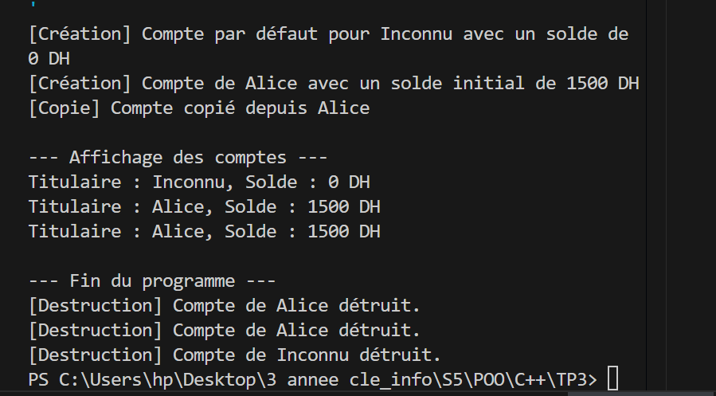
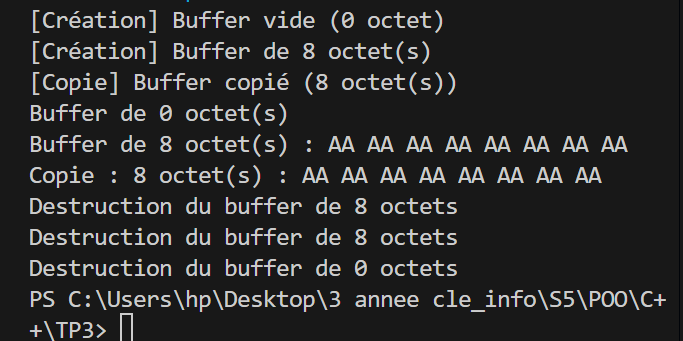

#  TP3 – Constructeurs et Destructeurs  

## Exercice 1 : Gestion d’un Compte Bancaire

### Objectif
Mettre en œuvre différents types de constructeurs et un destructeur dans une classe représentant un **compte bancaire**.

---


###  Énoncé
Créer une classe `CompteBancaire` qui gère les opérations suivantes :

####  Attributs privés
- `titulaire` : nom du titulaire (`string`)
- `solde` : montant du solde (`double`)

## Exemple d’exécution

```
[Création] Compte par défaut pour Inconnu avec un solde de 0 DH
[Création] Compte de Alice avec un solde initial de 1500 DH
[Copie] Compte copié depuis Alice

--- Affichage des comptes ---
Titulaire : Inconnu, Solde : 0 DH
Titulaire : Alice, Solde : 1500 DH
Titulaire : Alice, Solde : 1500 DH

--- Fin du programme ---
[Destruction] Compte de Alice détruit.
[Destruction] Compte de Alice détruit.
[Destruction] Compte de Inconnu détruit.

```
 ##  Exemple d’exécution (image)
 
Voici un exemple de l'exécution du programme (screenshot) : 



 
## Exercice 2 : Gestion d’un Buffer Dynamique  

---

##  Objectif
Apprendre à gérer **l’allocation et la libération de mémoire dynamique** dans une classe C++.

L’exercice met en œuvre :
- un **constructeur par défaut** ;
- un **constructeur paramétré** (avec taille) ;
- un **constructeur de copie** (copie profonde) ;
- un **destructeur** correctement implémenté.

---

## Exemple d’exécution attendue

```
[Création] Buffer vide (0 octet)
[Création] Buffer de 8 octet(s)
[Copie] Buffer copié (8 octet(s))
Buffer de 0 octet(s)
Buffer de 8 octet(s) : AA AA AA AA AA AA AA AA
Copie : 8 octet(s) : AA AA AA AA AA AA AA AA
Destruction du buffer de 8 octets
Destruction du buffer de 8 octets
Destruction du buffer de 0 octet

```
 ##  Exemple d’exécution (image)
 
Voici un exemple de l'exécution du programme (screenshot) : 




